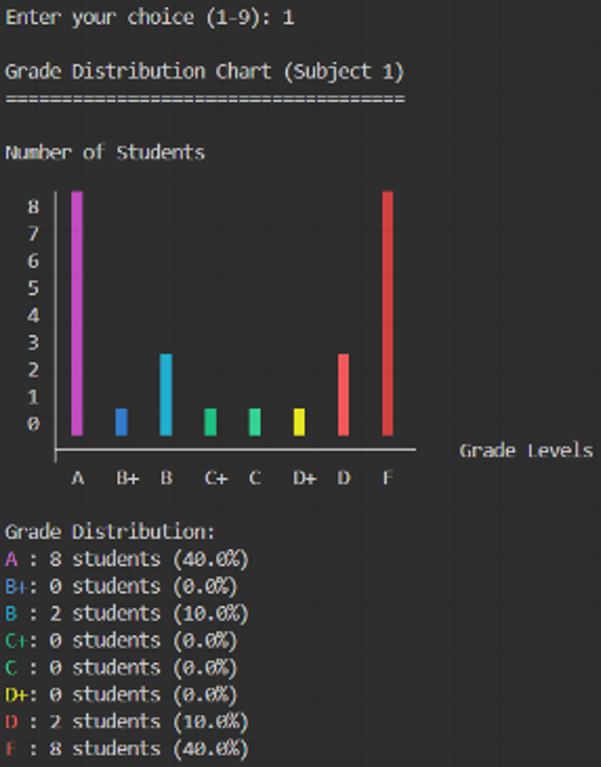

# Student Grading System

## Example Output

## English 🇺🇸

**Computer Programming for Engineers Project**  
**Title: Student Grading System**

The *Student Grading System* is designed to help manage and evaluate student academic performance.  
It can import student scores from a `.txt` file, calculate academic results, and allows users to edit student data in case of incorrect entries.  
It can also determine the highest, lowest, and average scores for each subject.

The program provides graphical visualizations to help users better understand the overall performance.  
If individual student details are needed, the system can export the data to a `.txt` file.

### Project Objective:
The purpose of this project is to facilitate the management of student academic records.  
It offers efficient data processing and can be extended for use in various educational institutions.

### Key Features:

1. **Student Score Management**
   - Import scores from `.txt` files
   - Edit student data if any entry is incorrect

2. **Data Processing**
   - Calculate academic results
   - Find the highest and lowest scores per subject
   - Compute the average score per subject

3. **Data Visualization**
   - Display results as graphs for easier analysis
   - Generate individual student reports and export them as `.txt` files

---

## ภาษาไทย 🇹🇭

**โครงงาน Computer Programming for Engineers**  
**หัวข้อ: Student Grading System**

ระบบ Student Grading System เป็นระบบที่ออกแบบมาเพื่อช่วยจัดการและประเมินผลการเรียนของนักศึกษา  
ระบบนี้สามารถดึงคะแนนของนักศึกษาจากไฟล์ `.txt` คำนวณผลการเรียน และสามารถแก้ไขข้อมูลของนักศึกษาได้ในกรณีที่กรอกผิดพลาด  
นอกจากนี้ยังสามารถหาค่าสูงสุด ต่ำสุด และค่าเฉลี่ยของคะแนนแต่ละรายวิชาได้อีกด้วย

โปรแกรมยังสามารถแสดงผลออกมาในรูปแบบกราฟ เพื่อให้สามารถดูภาพรวมของผลการเรียนได้ง่ายยิ่งขึ้น  
หากต้องการดูคะแนนของนักศึกษารายบุคคล ระบบสามารถดึงข้อมูลออกมาเป็นไฟล์ `.txt` ได้

วัตถุประสงค์ของโครงงานนี้ คือการอำนวยความสะดวกให้กับผู้ใช้งานในการจัดการข้อมูลผลการเรียนของนักศึกษา  
ระบบสามารถประมวลผลข้อมูลได้อย่างมีประสิทธิภาพ และสามารถปรับขยายเพื่อรองรับการใช้งานในสถาบันต่าง ๆ ได้

### ฟีเจอร์หลักของระบบ:

1. **จัดการข้อมูลคะแนนนักศึกษา**
   - ดึงคะแนนจากไฟล์ `.txt`
   - แก้ไขข้อมูลนักศึกษาในกรณีกรอกผิดพลาด

2. **การประมวลผลข้อมูล**
   - คำนวณผลการเรียน
   - หาค่าคะแนนสูงสุดและต่ำสุดในแต่ละรายวิชา
   - คำนวณค่าเฉลี่ยของคะแนนแต่ละวิชา

3. **การแสดงผลข้อมูล**
   - แสดงผลในรูปแบบกราฟเพื่อให้ง่ายต่อการวิเคราะห์ภาพรวม
   - สร้างรายงานคะแนนของนักศึกษารายบุคคล และส่งออกเป็นไฟล์ `.txt`

